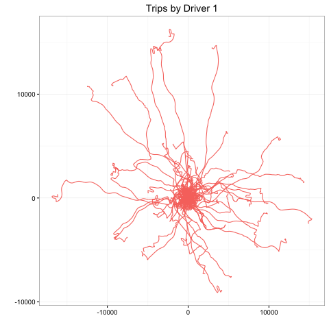
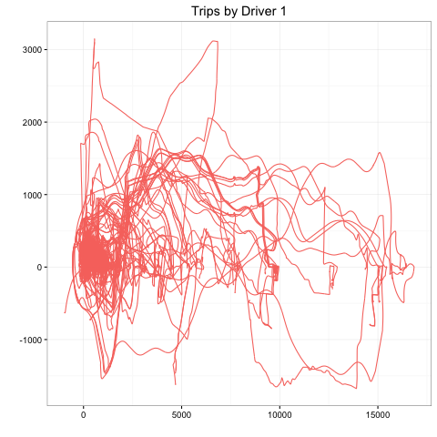
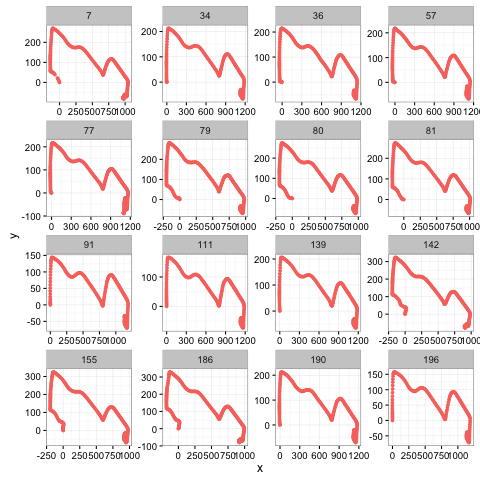

Step 1: download data from https://www.kaggle.com/c/axa-driver-telematics-analysis/data and save to local directory

Step 2: load the required libraries and local work directory.
```{r, results="hide", message=FALSE, eval=FALSE}
require("dplyr")
require("data.table")
require("randomForest")
require("ggplot2")
require("plyr")
# disable scientific notation
options(scipen=999)
setwd('/Users/Kay/Github/Z-T_Statistics/driver')
```

Step 3: read the raw data from `drivers` folder. 

```{r, results='hide', fig.height=4, fig.width=6, eval=FALSE} 
Drivers <- as.numeric(list.files(path = "drivers/"))
NB_DRIVERS <- length(Drivers)
NB_TRIPS <- 200

# Use fread from the data.table package to read in x and y coords
# Apply trip ID to new third column in data frame
fread_modify <- function(file.number, driver) {
  tmp <- fread(paste0("drivers/",driver,"/",file.number,".csv"), header=T, sep=",")
  tmp[, tripID:=file.number]
  return(tmp)
}

driverlist <- list.files("./drivers/")
dir.create("./data/", showWarnings = TRUE, recursive = FALSE, mode = "0777")

# Loop through the driver list and use rbindlist to bind data from
# x, and y columns to the specific driver data frame
for (i in 1:length(driverlist)) {
  onedriver <- driverlist[i]
  drives <- rbindlist(lapply(1:200, fread_modify, onedriver))
  save(drives, file = paste('./data/DriverData',onedriver, sep=''))
}


read_trips = function(x){
  setwd(x)
  dir_list = list.files(x)
  dir_list = dir_list[grep('[[:alpha:]]{0,3}.csv', dir_list)]
  num_files = length(dir_list)
  files = lapply(dir_list, read.csv)
  idx = unlist(lapply(files, nrow))
  trip = rep(1:num_files, idx)
  files = do.call(rbind, files)
  time = unlist(sapply(idx, function(x) seq(from=1, to=x, by=1)))
  files = cbind(files, trip, time)
  }

```

Step 4: use `ggplot` to visualize all trips by driver 1

```{r, results='hide', fig.height=4, fig.width=6, eval=FALSE} 
driverOne$dist = sqrt(driverOne$x^2+driverOne$y^2)

png('driver1.png')
ggplot(data = driverOne, aes(x=x,y=y, group=trip, color="red", label=trip))+geom_path()+theme_bw()+xlab('')+ylab('')+theme(legend.position='none')+ ggtitle('Trips by Driver 1')
dev.off()
```


Step 5: create function `rot_all` to rotate all trips by driver 1 and plot in graph again

```{r, results='hide', fig.height=4, fig.width=6, eval=FALSE} 
rot_all = function(df){
  n = matrix(ncol=2)
  for(i in 1:length(unique(df$trip))){
    dists = df[df$trip == i,c('x','y','dist')]
    mp = dists[max.col(t(dists$dist),'last'),1:2]
    rot.mat = matrix(c(mp$x,mp$y,-mp$y,mp$x),2,2)/sqrt(mp$x^2+mp$y^2) 
    rot.points = as.matrix(df[df$trip==i,1:2])%*%rot.mat
    if (sum(sign(rot.points[,2]))<0) rot.points[,2] = - rot.points[,2]
    n = rbind(n, rot.points)
  } 
  n = n[-which(is.na(n)),]
  n = as.data.frame(n)
  n = cbind(n, df$trip, df$time, df$dist)
  colnames(n) = c('x','y','trip','time', 'dist')
  return(n)
}
driverOne_rot = rot_all(driverOne)

png('driver1_rot.png')
ggplot(data = driverOne_rot, aes(x=x,y=y, group=trip, color="red", label=trip))+geom_path()+theme_bw()+xlab('')+ylab('')+theme(legend.position='none')+ ggtitle('Trips by Driver 1')
dev.off()
```


Step 6: look at each trip one by one, similar trips can be found for driver 1

```{r, results='hide', fig.height=4, fig.width=6, eval=FALSE} 
selected_trip = c(7,34,36,57,77,79,80,81,91,111,139,142,155,186,190,196)

png('driver1_sam.png')
ggplot(data=filter(driverOne_rot,(trip %in% selected_trip)))+geom_point(aes(x=x,y=y,color="red"),size=1)+
facet_wrap(~ trip,scales="free")+theme_bw()+theme(legend.position="none")
dev.off()
```


Step 7: use `Summary_Driver_Trips` to generate 29 features we need.

```{r, results='hide',eval=FALSE}
Summary_Driver_Trips <- function(driver) {

  # recover the names of the csv files
  driver_files <- list.files(path = paste("./drivers/",driver,sep="")) 
    # initialize the matrix which will store the summary of the 200 trips
  	summary <- matrix(nrow=200, ncol=29)
  	# trip counter (from 1 to 200)
  	t=1 
  	# recover trip data for each csv file in each driver folder
	for (file in driver_files){
	    # x & y coordinates
		coord <- as.matrix(read.csv(paste("./drivers/",driver,"/", file, sep=""))) 
		# create some variables for each record of the trip
		trip  <- as.numeric(strsplit(file,"[.]")[[1]][1])

		time = 1:nrow(coord)
		dist_to_origin = sqrt(coord[,1]^2 + coord[,2]^2)
		speed = 0 ; speed[2:nrow(coord)] = sqrt(diff(coord[,1],1)^2 + diff(coord[,2],1)^2)
		acc = 0 ; acc[2:nrow(coord)] = diff(speed,1)
		acc_flag = ifelse(acc>1.5, 1, 0) # flag for important accelerations
		dec_flag = ifelse(acc< -2, 1, 0) # flag for important decelerations

		# Aggregation at the trip level

		# Speed
		avg_speed=mean(speed); sd_speed=sd(speed); min_speed=min(speed); max_speed=max(speed)
		q1_speed=quantile(speed, probs = 0.25)
		q2_speed=quantile(speed, probs = 0.50)
		q3_speed=quantile(speed, probs = 0.75)
		
		# Acceleration
		avg_acc=mean(acc); sd_acc=sd(acc); min_acc=min(acc); max_acc=max(acc)
		q1_acc=quantile(acc, probs = 0.25)
		q2_acc=quantile(acc, probs = 0.50)
		q3_acc=quantile(acc, probs = 0.75)
		
		# Distance to origin
		avg_dist_to_orig=mean(dist_to_origin); sd_dist_to_orig=sd(dist_to_origin); max_dist_to_orig=max(dist_to_origin)
		q1_dist_to_orig=quantile(dist_to_origin, probs = 0.25)
		q2_dist_to_orig=quantile(dist_to_origin, probs = 0.50)
		q3_dist_to_orig=quantile(dist_to_origin, probs = 0.75)
		
		# Others
		trip_duration=max(time)
		crow_flight=sqrt(coord[nrow(coord), 1]^2 + coord[nrow(coord), 2]^2)
		acc_time=sum(acc_flag)
		dec_time=sum(dec_flag)
		trip_length = trip_duration * avg_speed
		crow_ratio = crow_flight / trip_length
		is_internal = 1 
    
		# for now we assume all the trips have been done by this driver
		summary[t,]= cbind(driver, trip, avg_speed, sd_speed, min_speed, max_speed, q1_speed, q2_speed, q3_speed, avg_acc, sd_acc, min_acc, max_acc, q1_acc, q2_acc, q3_acc, avg_dist_to_orig, sd_dist_to_orig, max_dist_to_orig, q1_dist_to_orig, q2_dist_to_orig, q3_dist_to_orig, acc_time, dec_time, trip_duration, crow_flight, trip_length, crow_ratio, is_internal) 
		# increment the trip counter
		t=t+1 
	}
	return(summary)
}
```

Step 8: apply the function `Summary_Driver_Trips` we created in step 4 to all the drivers and store the result in `DriversTripsSummary`

```{r, results='hide',eval=FALSE}
GlobalTripsSummary = matrix(nrow=NB_DRIVERS * NB_TRIPS, ncol=29)
colnames(GlobalTripsSummary) =  c('driver', 'trip', 'avg_speed', 'sd_speed', 'min_speed', 'max_speed', 'q1_speed', 'q2_speed', 'q3_speed', 'avg_acc', 'sd_acc', 'min_acc', 'max_acc', 'q1_acc', 'q2_acc', 'q3_acc', 'avg_dist_to_orig', 'sd_dist_to_orig', 'max_dist_to_orig', 'q1_dist_to_orig', 'q2_dist_to_orig', 'q3_dist_to_orig', 'acc_time', 'dec_time', 'trip_duration', 'crow_flight', 'trip_length', 'crow_ratio', 'is_internal')

# driver counter
d=1 

for(driver in Drivers){
	driverTripsSummary= Summary_Driver_Trips(driver)
	GlobalTripsSummary[seq((d-1)*NB_TRIPS+1, d*NB_TRIPS),] = driverTripsSummary
	d=d+1
}

# Save the result in a csv file
write.csv(GlobalTripsSummary, 'GlobalTripsSummary.csv', row.names=FALSE)
```

Step 9: convert problem into supervised learning problem by labeling all 200 trips from the selected driver as 1, while ramdonly select 200 trips from other drivers and label them as 0

```{r, results='hide',eval=FALSE}
GlobalTripsSummary = read.table('GlobalTripsSummary.csv', sep=',' , header = TRUE, stringsAsFactors=FALSE)
GlobalTripsSummary  = GlobalTripsSummary [order(GlobalTripsSummary$driver, GlobalTripsSummary$trip),]

#get the trips of a driver and add "NbExternalTrips" external trips to build the train set
CreateTrain = function(driver, NbExternalTrips){
  InternalTrips = GlobalTripsSummary[which(GlobalTripsSummary[,'driver']==driver), ]
	ExternalTrips = GlobalTripsSummary[sample(which(GlobalTripsSummary[,'driver']!=driver), size = NbExternalTrips), ]
	ExternalTrips[,'is_internal'] = 0
	Train = rbind(InternalTrips, ExternalTrips)
	return(Train)
}
```

Step 10: use `randomForest` to train the data and predict result

```{r, results='hide',eval=FALSE}
ComputeProbability = function(Train){

	rf = randomForest(as.factor(is_internal) ~ avg_speed + sd_speed + max_speed + q1_speed + q2_speed + q3_speed + avg_dist_to_orig  + sd_dist_to_orig + max_dist_to_orig + q1_dist_to_orig + q2_dist_to_orig + q3_dist_to_orig + acc_time + dec_time + avg_acc + sd_acc + min_acc + max_acc + q1_acc + q2_acc + q3_acc + trip_duration + crow_flight + trip_length + crow_ratio , ntree = 50, nodesize=5, importance = TRUE,  data=Train)
	predictions = predict(rf, Train[1:200, ], type = "prob")[,2]
	return(predictions)
}

driver_trip = paste(GlobalTripsSummary$driver, '_', GlobalTripsSummary$trip, sep = '')
}
```

Step 11: convert result into `csv` file and submit it

```{r, results='hide',eval=FALSE}
CreateSubmission = function(NbExternalTrips, NbRecursion, NbTrain){
	prob_int = numeric(200)
	prob_final = numeric(200 * NbDrivers)
	## creation of a matrix where each vector is the probability of the train set
	prob_Trains=matrix(data=NA, nrow=NbTrips, ncol=NbTrain)

	i=1 # driver's count, which alternative

	for (driver in Drivers){
		print(i)
		for (j in 1:NbRecursion){
			for (train in 1:NbTrain){
				Train = CreateTrain(driver, NbExternalTrips)
				prob_Trains[,train]=ComputeProbability(Train)
			}
			prob_int=apply(X=prob_Trains, MARGIN=1, median)
			new_is_internal=ifelse(prob_int>=0.5,1,0)
			GlobalTripsSummary[seq((i-1)*200+1, i*200 ),"is_internal"]=new_is_internal
		}
		prob_final[seq((i-1)*200+1, i*200 )]=prob_int
		i=i+1
	}
	submission = cbind(driver_trip, prob_final)
	write.csv(submission, 'submission.csv', row.names=F, quote=F)
}

CreateSubmission(NbExternalTrips = 600, NbRecursion = 5, NbTrain= 50)


submission = read.table('submission.csv', sep=',' , header = TRUE, stringsAsFactors=FALSE)
submission = cbind(driver_trip, submission$prob_final)

write.csv(submission, 'submission.csv', row.names=F, quote=F)
```

Winner Solution: https://github.com/PrincipalComponent/AXA_Telematics \r\n

Winner Solution Description: http://blog.kaggle.com/2015/04/20/axa-winners-interview-learning-telematic-fingerprints-from-gps-data/ \r\n

trip matching: http://nycdatascience.com/kaggle-axa-telematics-trip-matching/ \r\n

more reference: https://rpubs.com/TimSch1/KaggleTelematics \r\n
